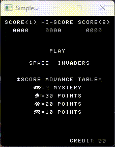

# Space Invaders 8080 Emulator



A Space Invaders 8080 emulator written in Rust.

## Overview

This project is a Rust implementation of an emulator for the classic Space Invaders arcade game, originally developed by Taito in 1978. The emulator is designed to faithfully replicate the original 8080 microprocessor-based hardware, allowing you to play the game just as it appeared in arcades during that era. It's incomplete for now as I didn't feel like implementing sound and I'm using a very basic graphics library. This was mostly meant as an exploration of Rust's capabilities while I learned some more advanced features outside of the simple tutorials.

## Features

- Emulates the 8080 microprocessor, ~~audio hardware~~, and video hardware of the Space Invaders arcade machine.
- Fully written in Rust for performance and portability.

## Getting Started

To get started with the emulator, follow these steps:

1. Clone this repository to your local machine:

   ```bash
   git clone https://github.com/FPGAwesome/space-invaders8080-rust.git
   cd space-invaders-emulator
   ```


2. Build or run the emulator:

    ```bash
    Build the emulator:
    cargo build --release

    Run the emulator:
    cargo run --release
    ```
